# Economic Data Pipeline

This project provides a simple data pipeline for downloading, cleaning, and organizing economic time series data from the FRED (Federal Reserve Economic Data) API. The goal is to build a small but realistic data engineering workflow that demonstrates ingestion, cleaning, and integration of macroeconomic datasets.

<p align="center">
  
</p>

## Features

* Retrieve time series data from the FRED API using a modular utility function. (`utils/fred_api.py`)
* Store raw data in a structured directory layout.
* Clean and normalize economic datasets for downstream analysis.
* Optional merging of multiple economic indicators into a unified dataset.
* Easily extendable to additional series such as unemployment rate, GDP growth, or interest rates.

## Requirements

* Python 3.10+
* requests
* pandas
* python-dotenv
* jupyter

After creating virtual environment and activating it install dependencies with:

```bash
pip install -r requirements.txt
```

## Environment Variables

Create a `.env` file in the project root with the following variable:

```
FRED_API_KEY=your_api_key_here
```

You can obtain an API key from the St. Louis Federal Reserve website: [https://fred.stlouisfed.org/](https://fred.stlouisfed.org/)

## Usage

Run the ingestion script to download a series (e.g., CPI):

```bash
python run_all_fetches.py
```

Run the cleaning script to convert and normalize the raw dataset:

```bash
python run_all_cleaning.py
```

Run the integration script if combining multiple datasets into a single one:

```bash
python run_integration.py
```

## ETL Pipeline Overview

This project implements a simple but realistic ETL (Extract‑Transform‑Load) workflow for macroeconomic time series.

### **Extract (Ingestion)**

* Fetch raw time series from the FRED API using `run_all_fetches.py`.
* Each series is stored as raw JSON under `data/raw/`.

### **Transform (Cleaning)**

* Normalize raw JSON into the standard `date,value` format.
* Convert all timestamps to ISO‑8601.
* Save cleaned results under `data/clean/`.

### **Load (Integration)**

* Merge all cleaned datasets into a unified macro dataset using `merge_macro.py`.
* Automatically resolves frequency differences between series.
* Final dataset is stored in `data/final/macro_dataset.csv` and as a SQLite database.

---

## Frequency Alignment

Economic datasets come in different native frequencies:

* **Daily**: S&P 500
* **Monthly**: CPI, Fed Funds, Housing Starts, Unemployment Rate, M2
* **Quarterly**: GDP

To build a consistent dataset, the integration step converts all series into **monthly frequency**.

### **Daily → Monthly (S&P 500)**

Uses **month‑end closing price**:

* `resample("ME").last()` selects the last available trading day of the month.
* Index is shifted to month start for alignment.

### **Quarterly → Monthly (GDP)**

Quarterly values are extended across the three months using **forward fill (LOCF)**:

* `resample("MS").ffill()`
* This is the standard approach in econometrics.

### **Monthly → Monthly (CPI, M2, FedFunds, etc.)**

Series may not always be recorded on the 1st of the month.
All monthly series are normalized to month start using:

* `resample("MS").ffill()`

This ensures **all series share the same monthly time index**, enabling clean merging and analysis.

---

This project uses the FRED® API but is not endorsed or certified by the Federal Reserve Bank of St. Louis.® API but is not endorsed or certified by the Federal Reserve Bank of St. Louis.
